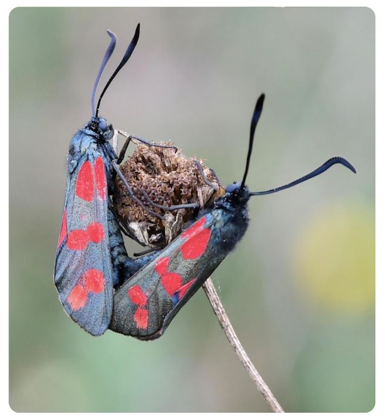

Rainer Theuer
# Insektenfauna Sehnde
## Die Insektenfauna auf der ehemaligen Abraumhalde des Neubaus der Schleuse Bolzum am Stichkanal nach Hildesheim

Titelbild: Sechsfleck-Widderchen (Zygaena filipendulae) aufgenommen am 22.August 2021

# Dokumente

Falls die PDFs nicht angezeigt werden, nutzen Sie bitte den Chrome-Browser oder laden Sie die Dateien herunter.

 Die 
 Insektenfauna auf der ehemaligen Abraumhalde des Neubaus der Schleuse Bolzum am Stichkanal nach Hildesheim 

 
 Tagfalterarten (Papilionoidea) der Region Hannover unter Berücksichtigung von Beobachtungsplattformen und Publikation

Theuer, R. (2025). Schmetterlingsfauna im Garten. Ein Jahr der Beobachtung
